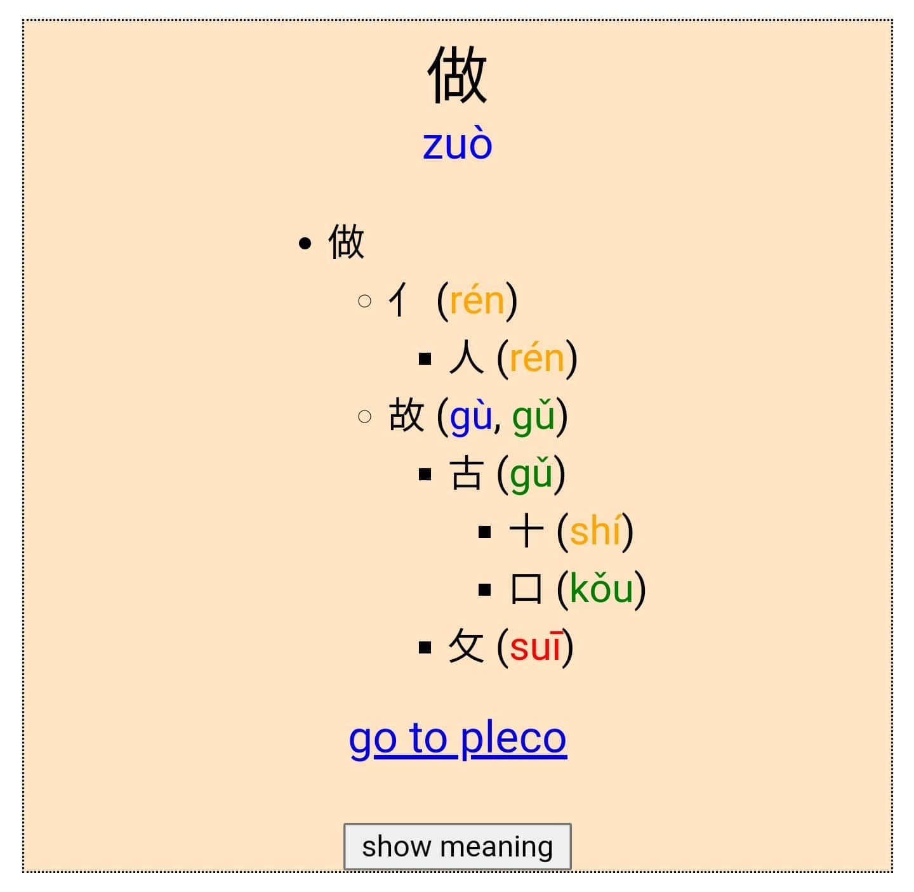
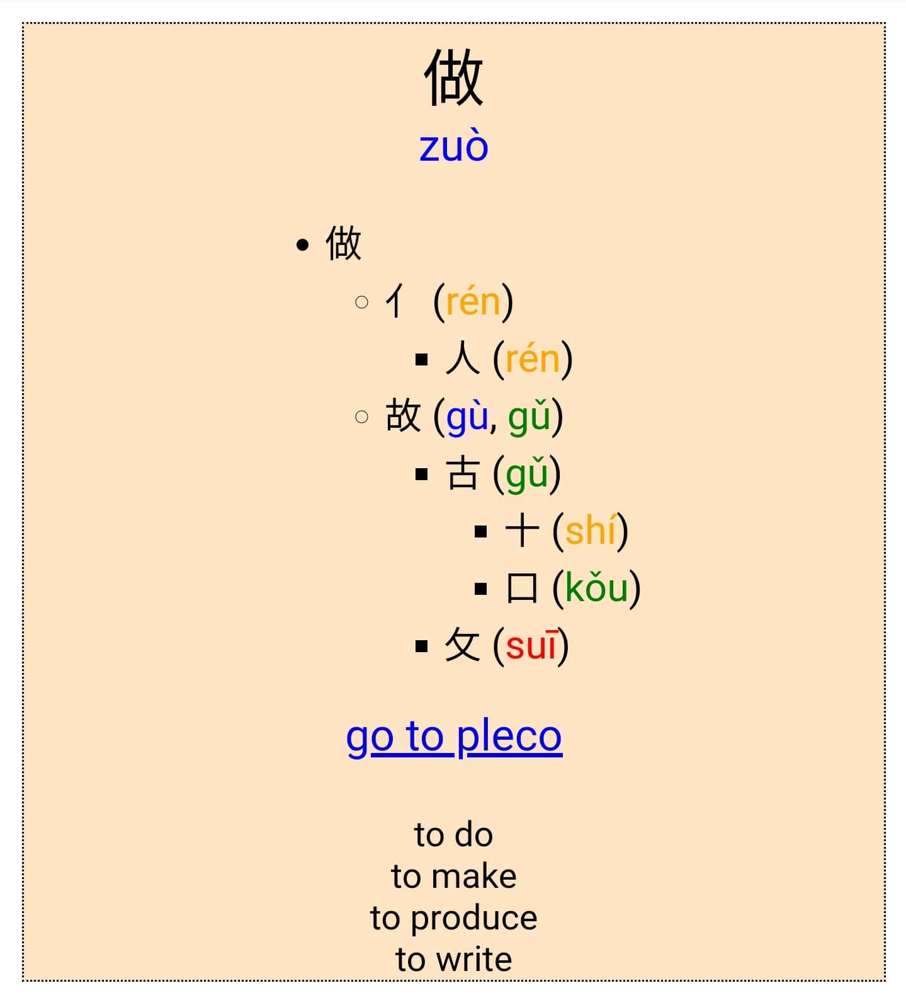

## About
Generate a flashcard deck for [Anki](https://apps.ankiweb.net/) based off [a study done by Loach](https://arxiv.org/abs/1602.08742) on an optimal learning order of the Chinese characters. That is, optimal in the sense that useful knowledge is maximized with respect to effort required. The idea is we initially order characters by a function of frequency and effort required to learn (stroke count) and then perturb this ordering via a topological sort so that any components of a character appear before it yet our ordering by the function of frequency and effort is still best preserved.

## Functionality
Each card includes
- hanzi
- pinyin
- character decomposition with pinyin
- deeplink to pleco definition
- meaning in english (hidden behind button)

## Example
### 做

